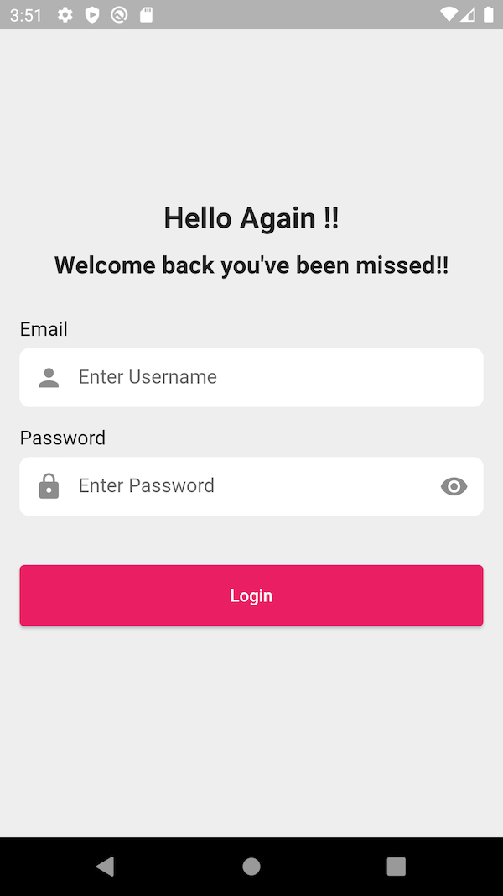

# Webkul TextField With Label
A quick way to create a TextField aligned with label.

## Features
A simple and effective way of creating TextFields in order to enhance the UI of your application.



## Getting started

Add the latest version of package to your pubspec.yaml (and run`dart pub get`):
```yaml
dependencies:
  webkul_textfield_with_label: ^0.0.1
```

## Usage

```dart
import 'package:webkul_textfield_with_label/webkul_textfield_with_label.dart';
```


After importing the above line in your code, you can use the TextField just like you use any other widget.

With the help of this package, you can specify the Label & can customize it as per you requirement.


```dart
TextFieldWithLabel(labelText:"...//Write the name");
```

**labelText** is the required property.

## Properties

Here are some of the major properties supported by the package...

<!-- TABLE_GENERATE_START -->

| Properties | Description                                                        |
|--|--------------------------------------------------------------------|
| labelText | Specify the label you want to display as heading of your textField |
| labelTextStyle |  Specify the TextStyle for your label                                                       |
| gapBtwLblAndField | Specify the spacing between Label & TextField. By default it is 6.0
| decoration | Specify the decoration for the TextField with InputDecorationTextField class
<!-- TABLE_GENERATE_END -->


With this package, you can use all the properties provided by the TextFormField in Flutter by default.


## Sample Usage
```dart
TextFieldWithLabel(
                    controller: emailController,
                    labelText: "Email",
                    inputDecorationTextField: InputDecorationTextField(
                      prefixIconImage: const Icon(Icons.person),
                      hint: 'Enter Username',
                      filledColor: Colors.white,
                      isEnabled: true,
                      isFilled: true,
                      contentEdgePadding: const EdgeInsets.all(14.0),
                      focusedInputBorder: OutlineInputBorder(
                          borderSide: const BorderSide(color: Colors.white),
                          borderRadius: BorderRadius.circular(8.0)),
                      enabledInputBorder: OutlineInputBorder(
                          borderSide: const BorderSide(color: Colors.white),
                          borderRadius: BorderRadius.circular(8.0)),
                      errorInputBorder: OutlineInputBorder(
                          borderSide: const BorderSide(color: Colors.red),
                          borderRadius: BorderRadius.circular(8.0)),
                    ),
                    validator: (value) {
                      if (!RegExp(
                              r"^[a-zA-Z0-9.a-zA-Z0-9.!#$%&'*+-/=?^_`{|}~]+@[a-zA-Z0-9]+\.[a-zA-Z]+")
                          .hasMatch(value ?? "")) {
                        return "Incorrect Email";
                      }
                    }),
```


See the **example** directory for a complete sample app.


